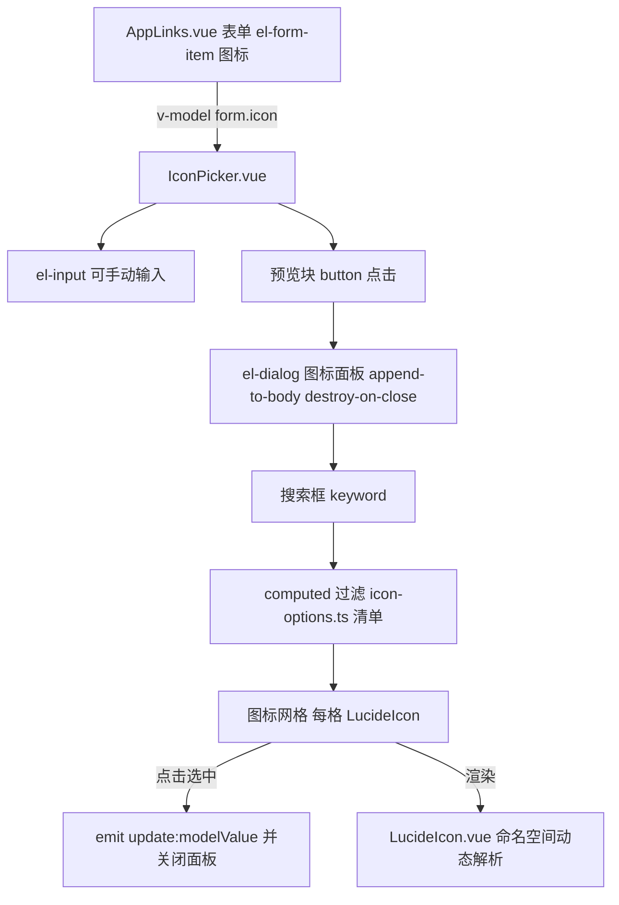

## 产品概述

后台「应用链接管理」（`frontend/src/views/admin/AppLinks.vue`）的「新增/编辑链接」弹窗中，图标字段当前只是一个纯文本输入框 + 原生 `datalist`（仅 12 个文字候选），点击不会弹出任何图标面板；输入框右侧那个 36×36 淡蓝圆角块只是图标实时预览，不可点击。用户误以为二者是「图标选择器」和「某个按钮」，实际体验不可用。

## 核心特性

- **可视化图标选择器**：点开图标面板，以缩略图网格浏览图标，点选即回填到表单，替代手打 lucide 图标名。
- **搜索定位**：面板内按图标英文名 / 中文标签模糊搜索，实时过滤（大小写不敏感）。
- **保留手动输入**：输入框仍可编辑，直接输入任意合法 lucide 图标名；非法名称沿用现有 fallback（渲染为 `Link`）。
- **明确预览块语义**：把预览块改为可点击的按钮态（带 hover/光标反馈），点击即打开选择面板，消除「这按钮是干什么的」的歧义。
- **精选图标范围**：内置约 100 个办公 / 协作 / 门户场景常用图标，全部经 lucide 有效性校验。

## 技术栈

沿用项目现有栈，**不引入任何新依赖**：Vue 3.5 + TypeScript（`<script setup lang="ts">`）+ Element Plus 2.14 + Tailwind 3.4 + Vite 5.4 + `lucide-vue-next ^0.577.0`（已在 devDependencies 且被 src 引用）。

## 实现方案

新增一个可复用组件 `IconPicker.vue`，把「图标输入 + 预览 + 选择面板」三件事收敛为单一受控组件（`v-model` 绑定图标名字符串），`AppLinks.vue` 只保留一行 `<IconPicker v-model="form.icon" />`，删除临时 `iconHints` 与原生 `<datalist>`。

**关键决策与权衡**

1. **面板形态用 `el-dialog` + `append-to-body`，而非 `el-popover`**：图标网格需要约 600px 宽度与独立滚动区，`el-popover` 在 `el-form-item` 内易被表单容器裁切、需额外 teleport 适配；而本组件本身就在「新增链接」的 `el-dialog` 内，Element Plus 官方支持嵌套 dialog 并自动递增 z-index，加 `append-to-body` 即可避免被外层弹窗层级/样式污染。
2. **渲染必须复用 `LucideIcon.vue`，禁止新写一份 `import * as icons from 'lucide-vue-next'`**：`LucideIcon.vue` 已用命名空间导入做动态索引，再引入一份会让 lucide 命名空间模块被重复加载、构建产物膨胀。新组件内部网格项统一调用 `LucideIcon`，只持有「图标名」字符串数组，零图标组件静态导入。
3. **图标清单抽到 `src/config/icon-options.ts`**：清单是数据不是逻辑，独立后便于校验、复用与后续扩展（其他页面将来接图标字段可直接引用），也保持组件文件精简。
4. **图标名有效性校验是头号风险点**：lucide 导出名为 PascalCase（如 `BookOpen`、`BarChart3`、`ClipboardCheck`），手写清单极易出现版本内不存在的名字，导致运行时全部 fallback 成 `Link`（静默失败，肉眼难发现）。因此清单落库前必须以 `node_modules/lucide-vue-next/dist/esm/icons/`（kebab-case 文件名）为事实来源做脚本化比对，剔除无效项。
5. **不做防抖 / 虚拟滚动**：清单约 100 项，过滤是 O(n) 字符串匹配（n≈100），远低于 16ms 预算；一次性挂载约 100 个 SVG 仅在弹窗打开时发生，配合 `destroy-on-close` 关闭即销毁，不引入额外复杂度（YAGNI）。

## 实现要点（执行细节）

- **受控数据流**：`IconPicker` 通过 `defineModel` / `modelValue` + `update:modelValue` 双向绑定；内部编辑输入框时同步 emit，点选网格时回填并关闭面板。禁止组件内部复制一份独立状态导致与父级 `form.icon` 不同步。
- **沿用现有设计令牌**：选中态用 `bg-[#F0F4FD] text-primary-deep`（与表格图标列、预览块视觉一致），hover 用 `hover:bg-[#F0F4FD]`，选中描边 `ring-2 ring-primary`；文字层级用 `text-ink` / `text-ink-sub` / `text-ink-mute`（已在 `tailwind.config.js` 定义：`primary #5B8FF9`、`primary-deep #3B6FE0`、`ink #1F2D3D`、`ink-mute #9099A8`）。
- **预览块改为按钮语义**：`<button type="button">` + `cursor-pointer` + hover 反馈 + `title="点击选择图标"`，避免用户再次误判；同时防止在 `el-form` 内触发隐式提交（必须写 `type="button"`）。
- **中文标签**：清单每项带 1–2 个词的中文别名（如 `BookOpen → 知识库`），搜索同时匹配英文名与中文标签，全部转小写比较。
- **空态与兼容**：搜索无结果时显示「未找到匹配的图标，可直接在输入框输入图标名」；非法图标名的渲染 fallback 完全交给 `LucideIcon.vue` 现有逻辑（回退 `Link`），不在新组件重复实现。
- **爆炸半径控制**：只动 `AppLinks.vue` 的图标字段与新增两个文件。`AppLinkCard.vue`、`StatCard.vue`、`AdminLayout.vue` 均为图标只读渲染，不改；其余 4 个 admin 视图无图标字段，不推广。

## 架构设计



## 目录结构

```
frontend/
├── src/
│   ├── config/
│   │   └── icon-options.ts        # [NEW] 精选图标清单：导出 ICON_OPTIONS（约 100 项，每项 { name: 英文导出名, label: 中文标签 }）与类型 IconOption。必须并入现有 12 个 iconHints（BookOpen/ClipboardCheck/Users/CalendarDays/KanbanSquare/GitBranch/FolderOpen/BarChart3/Link/Globe/Mail/MessageSquare）并去重；每一项的名字都需通过 lucide 存在性校验。
│   ├── components/
│   │   └── IconPicker.vue         # [NEW] 图标选择器。含可编辑 el-input、可点击预览按钮、el-dialog 面板（搜索框 + 响应式图标网格 + 选中高亮 + 空态 + 底部显示当前所选）。内部一律复用 LucideIcon 渲染，禁止新增 lucide 命名空间导入。
│   └── views/
│       └── admin/
│           └── AppLinks.vue       # [MODIFY] 第 22 行删除 iconHints；第 163-173 行「图标」字段替换为 <IconPicker v-model="form.icon" />，删除原生 datalist；新增 IconPicker 导入。表格图标列（第 130 行）保持不变。
└── scripts/
    └── verify-icon-options.mjs    # [NEW] 一次性校验脚本：读取 node_modules/lucide-vue-next/dist/esm/icons 目录，比对 ICON_OPTIONS 中每个 name 是否存在，输出无效清单并退出非零。校验通过后本文件可保留或删除。
```

## 关键代码结构

```ts
// frontend/src/config/icon-options.ts
export interface IconOption {
  /** lucide-vue-next 的 PascalCase 导出名，如 'BookOpen' */
  name: string
  /** 中文标签，用于搜索与 tooltip，如 '知识库' */
  label: string
}
export const ICON_OPTIONS: IconOption[] = [/* 约 100 项，全部经存在性校验 */]
```

```ts
// frontend/src/components/IconPicker.vue 对外契约
const props = withDefaults(
  defineProps<{ modelValue: string; size?: number; placeholder?: string }>(),
  { size: 18, placeholder: '点击右侧图标选择，或输入图标名' },
)
const emit = defineEmits<{
  (e: 'update:modelValue', value: string): void
  (e: 'change', value: string): void
}>()
```

## 验证方式

- `npm run build`（`vue-tsc -b && vite build`）类型检查与构建必须通过。
- 浏览器真实驱动验证：打开后台 → 应用链接 → 新增链接 → 点击预览块 → 面板展开 → 搜索「知识」→ 命中 `BookOpen` → 点击 → 输入框回填 → 保存 → 表格图标列正确渲染；另验手动输入非法名不崩溃（回退 `Link`）。

## 设计风格

沿用项目既有的企业门户后台视觉语言：白底卡片 + 淡蓝（#F0F4FD）主色系 + 轻阴影 + 圆角，风格为「清爽企业风 / Fluent 轻拟物」。不引入新的设计体系或第三方组件库，图标面板的配色与圆角、间距与表格图标列、搜索区完全一致，保证新增面板与现有页面无缝融合。

## 图标选择面板设计（自上而下分块）

1. **面板头部**：标题「选择图标」，右上角关闭；下方一行搜索框（前置放大镜图标、可清空），placeholder「搜索图标名称，如 知识库 / BookOpen」。
2. **图标网格**：响应式网格（移动端 6 列、桌面 8–10 列），每格 44×44 圆角方块，内含 20px 线性图标，下方 11px 灰色图标名（单行省略，hover 显示完整名 tooltip）。hover 时底色淡蓝 + 轻微上浮；当前选中项加深底色并加 2px 主色描边，一眼可辨。
3. **空态**：无匹配时居中显示灰色提示与放大镜占位图形，提示可直接在输入框手动输入图标名。
4. **面板底部**：左侧小号预览块 + 当前所选图标名，右侧「取消 / 确定」按钮，确定按钮为主色实心。

## 表单内触发区设计

输入框保持 Element Plus 原生样式；右侧 36×36 淡蓝圆角预览块改为可点击按钮：默认展示当前图标，hover 时底色加深 + 出现主色描边与「点击选择图标」tooltip，光标为手型，明确传达可交互语义，消除原先「这是干什么的」的歧义。

## 交互与动效

面板淡入 + 轻微缩放（复用 tailwindcss-animate）；网格项 hover 位移与变色 120ms 过渡；点选即回填并关闭，减少一次确认点击（键盘可达：网格项为 button，支持 Tab 与 Enter）。

## 响应式

弹窗宽度在窄屏自适应为 92vw，网格列数随宽度递减，避免横向滚动。

## 使用的扩展

### Skill

- **playwright-cli**
- 用途：在真实浏览器中驱动后台页面，验证「点击预览块 → 面板展开 → 搜索 → 点选回填 → 保存后表格图标正确渲染」的完整链路
- 预期结果：拿到可追溯的交互截图/断言证据；若后端接口未启动，至少验证弹窗与选择面板的 UI 行为并明确说明未覆盖范围