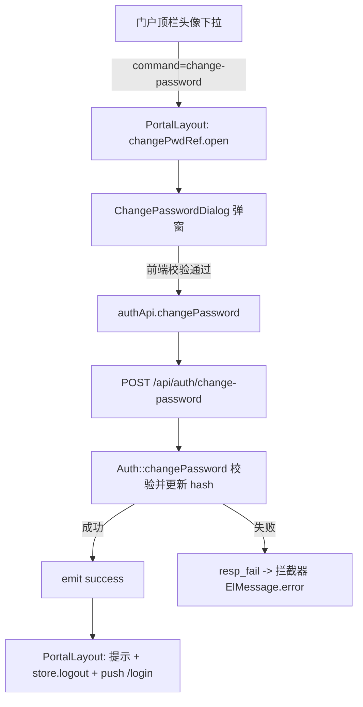

## 产品概述

为门户普通用户提供自助修改密码能力：在门户顶栏右上角头像下拉中新增「修改密码」入口，点击弹出改密窗口，校验原密码后设置新密码，成功后强制重新登录。

## 核心功能

- 门户顶栏头像下拉新增「修改密码」按钮（位于「退出登录」之上，带分隔线），仅门户 PortalLayout 加入，后台 AdminLayout 不改。
- 修改密码弹窗：原密码、新密码、确认新密码三项输入（密码框可明文切换），前端校验非空、新密码至少 8 位、两次输入一致、新密码不能与原密码相同。
- 提交后后端校验原密码正确性并更新密码；成功后提示「密码修改成功，请重新登录」，清除本地 Token 并跳转登录页（强制重新登录，避免旧 JWT 在有效期内继续可用）。
- 新密码强度沿用系统现有口径：长度至少 8 位，不额外增加复杂度校验。

## 技术栈

- 后端：ThinkPHP（PHP），沿用现有 `resp_ok`/`resp_fail`/`write_oplog` 助手、`BaseController` 的 `$this->request->userId`、`password_hash(PASSWORD_BCRYPT)` / `password_verify`；无新增依赖。
- 前端：Vue 3 + TypeScript + Vite + Element Plus（`el-dialog`/`el-form`/`el-input`）+ Pinia + lucide-vue-next，无新增依赖。
- 请求层：沿用 `frontend/src/api/request.ts`（自动注入 Bearer Token；非 0 状态码统一 `ElMessage.error` 并 reject），故前端只需 `.catch(console.error)`。

## 实现方案

采用「登录态接口 + 复用式弹窗组件」方案：

- **后端**：在 `Auth.php` 新增 `changePassword()`，挂载路由 `POST /api/auth/change-password`，位于 `api` 分组（`AuthCheck` 中间件）内、**不加 `PermissionCheck`**——普通用户无后台权限也必须能改自己的密码，这是该接口正确的权限边界。
- **前端**：新建 `ChangePasswordDialog.vue`，沿用项目既有弹窗惯例（`defineExpose({ open })` + 父组件 ref 调用，参考 `AnnouncementDetail.vue` 与 `Home.vue` 中 `detailRef.value?.open(item)` 的用法），由 `PortalLayout.vue` 挂载并在下拉命令 `change-password` 时打开。
- **强制重登**：成功后 `ElMessage.success` → `await store.logout()`（复用现有 logout，清 token/profile + `localStorage.removeItem('inue_token')`）→ `router.push('/login')`。

### 关键决策与权衡

- 改密接口不放 `admin` 分组、不绑权限码：自助改密是「对自己账号的基础操作」，若绑权限则普通用户仍无途径，与需求目标冲突。
- 强制重新登录而非保持会话：JWT 无状态、有效期 7200 秒，不主动清 Token 则旧凭证在改密后仍可用；用户已明确选择更安全的强制重登。
- 新密码仅校验 ≥8 位：与后台新建/重置密码（`admin/User.php`：`strlen($password) < 8` → 「密码长度至少8位」）口径一致，避免同一系统出现两套规则。
- 不引入 `<KeepAlive>`、不改 `AdminLayout`：严格贴合用户选择的入口范围，控制改动面。

## 实现要点

- **后端 `changePassword()` 校验顺序**（早失败、语义清晰）：三项非空 → 新密码 `strlen < 8` 报「密码长度至少8位」 → 新密码与原密码相同报「新密码不能与原密码相同」 → `User::find($this->request->userId)` → `password_verify` 校验原密码失败报「原密码错误」（422）→ `password_hash(PASSWORD_BCRYPT)` 更新 `password_hash` 并 `save()` → `write_oplog('auth.change-password', ...)` → `resp_ok([], '密码修改成功')`。
- 需在 `Auth.php` 顶部新增 `use app\model\User;`（当前未导入）。
- **前端校验与后端校验双写**：前端用 `el-form` 规则给即时反馈；后端独立校验（不可只依赖前端，接口可被直接调用）。
- 弹窗 `open()` 时重置表单与 loading 态，避免上次输入残留。
- 提交期间按钮 loading 防重复提交；错误由 request 拦截器统一提示，前端仅 `.catch(console.error)`。

## 架构设计



## 目录结构

```
backend/app/controller/
└── Auth.php                              # [MODIFY] 新增 changePassword()：非空/长度/新旧不同校验，password_verify 验原密码，password_hash 更新，write_oplog 记录；顶部补 use app\model\User;
backend/route/
└── app.php                               # [MODIFY] api 分组新增 Route::post('auth/change-password', 'Auth/changePassword')（仅 AuthCheck，无 PermissionCheck）
frontend/src/api/
└── index.ts                              # [MODIFY] authApi 新增 changePassword(oldPassword, newPassword)
frontend/src/components/
└── ChangePasswordDialog.vue              # [NEW] 修改密码弹窗：el-dialog + el-form（原密码/新密码/确认新密码，show-password），校验与提交，defineExpose({ open })，成功 emit('success')
frontend/src/layout/
└── PortalLayout.vue                      # [MODIFY] 下拉新增「修改密码」项（图标 KeyRound，divided 之上），handleCommand 处理 change-password，挂载弹窗并处理 success（提示 + 登出 + 跳登录页）
```

## 关键代码结构

```ts
// frontend/src/api/index.ts —— authApi 新增
changePassword: (oldPassword: string, newPassword: string) =>
  request.post('/auth/change-password', { old_password: oldPassword, new_password: newPassword }) as Promise<{ data: null }>,
```

```ts
// frontend/src/components/ChangePasswordDialog.vue —— 对外契约
const emit = defineEmits<{ success: [] }>()
function open(): void   // 打开并重置表单、清空输入
defineExpose({ open })
```

## 设计风格

延续门户现有克制、对齐的视觉语言：白底卡片、圆角、轻阴影，与顶栏及后台弹窗保持一致，不引入新视觉体系。

## 弹窗结构（自上而下分块）

1. **标题栏**：居中「修改密码」，`el-dialog` 宽度约 420px，圆角，右上角关闭图标。
2. **表单区**：三个表单项纵向排列——「当前密码」「新密码」「确认新密码」，均为密码输入框并带明文切换（眼睛图标）；标签左对齐、输入框满宽；底部灰字提示「新密码长度至少 8 位」。
3. **错误反馈**：字段下方内联红色校验文案（非空、长度不足、两次不一致、新旧相同）。
4. **操作区**：底部右对齐「取消」+「确定（主色实心按钮）」，确定按钮提交时显示 loading 并禁用防重复提交。

## 交互与动效

输入框聚焦态用品牌主色描边；按钮 hover 加深、点击态轻微缩放；弹窗沿用 Element Plus 默认淡入缩放动效。校验失败即时内联提示，不弹全局错误。成功后弹窗关闭并出现全局成功提示条，随后跳转登录页。

## Agent Extensions

### Skill

- **编程专家.Skill**
- Purpose：指导本次跨前后端功能的方案、实现、验证与收尾，确保根因闭环、安全边界（改密接口权限、密码策略）与验证证据完整
- Expected outcome：按六步闭环交付，产出后端接口 + 前端弹窗 + 入口接入，并给出可复现的验证证据与已知限制