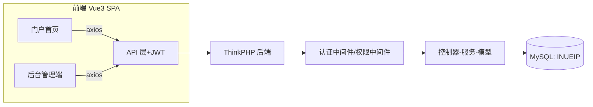

## 用户需求

基于设计稿「吟游廊 EIP平台」首页，从零开发一套企业信息门户（EIP）网站。工作区为空项目，需新建前后端工程。用户明确四点硬性要求：账号管理系统、权限管理系统、协作与办公/自定义工具两个区块必须由管理员配置链接后才渲染显示、MySQL 数据库名固定为 INUEIP。

## 产品概述

面向企业内部员工的信息门户首页：登录后展示按时段问候、考勤统计卡片（未打卡/迟到/待审批）、协作与办公入口（内部Wiki/审批中心/人事系统/会议室预订等可配置卡片）、公告与通知列表、自定义工具网格卡片；配套一套后台管理系统，供管理员维护账号、角色权限、应用链接（协作与办公+自定义工具）、公告内容。

## 核心功能

- **登录认证**：账号密码登录，Token 鉴权，未登录拦截跳转登录页
- **账号管理**：用户增删改查、启用/禁用、重置密码、分配角色
- **权限管理**：RBAC 模型（用户-角色-权限），后台菜单与接口按权限控制，至少区分超级管理员与普通用户
- **应用链接管理（核心特色）**：管理员配置名称、图标、副标题、跳转URL、所属分区（协作与办公/自定义工具）、排序、启用状态；首页按启用状态动态渲染，未配置则对应区块/卡片不显示
- **公告管理**：富文本发布/编辑/下架公告，首页展示已发布公告列表（标题+副标题+日期）
- **考勤统计占位**：首页三张统计卡片按接口渲染，本期接口返回占位/模拟数据，预留后续对接真实考勤系统
- **门户首页还原设计稿**：顶部导航（Logo+头像）、问候区、统计卡片区、协作与办公、公告与通知、自定义工具四大内容区块

## 技术选型

- **后端**：PHP 8.1+ + ThinkPHP 8（CMS 类项目开发快、部署简单；用户如需 Laravel 可同构替换，目录与表结构不变）
- **前端**：Vue3 + Vite + Element Plus + Pinia + Vue Router（中后台主流方案，卡片式 UI 契合设计稿）
- **数据库**：MySQL 8.0，库名 **INUEIP**，utf8mb4 / utf8mb4_general_ci，表前缀 `inue_`
- **鉴权**：JWT（Header 传递，后端中间件校验 + 权限注解）
- **密码安全**：password_hash（bcrypt）存储，登录限频（连续失败 5 次锁定 15 分钟）
- **富文本**：wangEditor（Element Plus 生态常用），正文 HTML 入库前做 XSS 白名单过滤（HTMLPurifier）

## 实现思路

单体分层架构：前端 SPA 通过 RESTful API 与后端交互；后端按「控制器-服务-模型」分层，门户首页只读聚合接口 + 后台管理 CRUD 接口分离；RBAC 权限在路由中间件统一校验。**关键决策**：

- 应用链接采用「分区（section: collab/custom）+ 状态（status）+ 排序」模型，首页接口只返回 status=启用 的记录，天然满足"配置后才显示"的需求
- 考勤统计独立 `attendance_stat` 占位接口（本期返回模拟数据），表结构与字段按真实打卡场景预留，后续对接只替换数据源
- 权限粒度采用菜单级 + 接口级双层，接口级在控制器方法上用权限标识校验，防止越权直调
- **性能**：首页聚合为 2 个接口（用户信息+统计、门户内容聚合），公告/链接列表均走单表索引查询（section+status+sort 联合索引），无 N+1；后台列表分页查询
- **可靠性**：配置/公告写操作记录操作日志（操作人、动作、时间），便于审计回溯

## 实现注意事项

- 数据库连接、JWT 密钥等敏感配置走 `.env`，不入库不提交版本库
- 富文本公告入库前必须 XSS 过滤；链接 URL 校验协议白名单（http/https）
- 软删除（deleted_at）用于用户与公告，避免误删不可恢复
- 日志复用 ThinkPHP 日志通道，ERROR 级落文件，不记录密码/Token；避免高频 INFO 刷屏
- 兼容性：所有接口统一响应格式 `{code, msg, data}`，前端 axios 拦截器统一处理 401/403

## 架构设计



## 数据库设计（库名 INUEIP，前缀 inue_）

- `inue_user`：id, username(唯一), password_hash, nickname, avatar, status, last_login_at, deleted_at
- `inue_role`：id, name, code(唯一), description, status
- `inue_permission`：id, parent_id, name, code(权限标识), type(menu/api), path
- `inue_user_role`：user_id, role_id（联合主键）
- `inue_role_permission`：role_id, permission_id（联合主键）
- `inue_app_link`：id, name, icon, subtitle, url, section(collab/custom), sort, status, created_at/updated_at —— 索引 (section,status,sort)
- `inue_announcement`：id, title, summary, content(富文本HTML), status(草稿/发布/下架), published_at, created_by, deleted_at —— 索引 (status,published_at)
- `inue_attendance_stat`：占位表，id, user_id, stat_date, unclock_count, late_count, pending_count（本期可不落真实数据）
- `inue_operation_log`：id, user_id, action, detail, ip, created_at

## API 设计（节选）

- `POST /api/auth/login`、`POST /api/auth/logout`、`GET /api/auth/profile`
- `GET /api/portal/summary`（考勤统计三数）+ `GET /api/portal/home`（链接分组+公告列表聚合）
- `GET/POST/PUT/DELETE /api/admin/users`、`POST /api/admin/users/:id/reset-password`
- `GET/POST/PUT/DELETE /api/admin/roles`、`POST /api/admin/roles/:id/permissions`
- `GET/POST/PUT/DELETE /api/admin/app-links`（按 section 过滤）
- `GET/POST/PUT/DELETE /api/admin/announcements`、`POST /api/admin/announcements/:id/publish|offline`
- `GET /api/admin/permissions`（权限树）

## 目录结构

```
INUEIP/
├── backend/                        # ThinkPHP 8 后端
│   ├── app/
│   │   ├── controller/
│   │   │   ├── Auth.php            # [NEW] 登录/登出/获取当前用户
│   │   │   ├── Portal.php          # [NEW] 门户首页聚合接口（统计+链接+公告）
│   │   │   └── admin/
│   │   │       ├── User.php        # [NEW] 账号管理 CRUD/重置密码
│   │   │       ├── Role.php        # [NEW] 角色与权限分配
│   │   │       ├── AppLink.php     # [NEW] 应用链接管理（核心特色）
│   │   │       └── Announcement.php# [NEW] 公告管理（富文本/上下架）
│   │   ├── middleware/
│   │   │   ├── AuthCheck.php       # [NEW] JWT 校验
│   │   │   └── PermissionCheck.php # [NEW] 接口级权限校验
│   │   ├── model/                  # [NEW] User/Role/Permission/AppLink/Announcement 等模型
│   │   └── service/                # [NEW] AuthService/PortalService 业务层
│   ├── config/、route/route.php    # [NEW] 路由与中间件注册
│   ├── database/migrations/        # [NEW] 全部建表迁移 + 初始数据（超管账号/默认角色/权限树）
│   └── .env.example                # [NEW] 环境变量样例（DB=INUEIP）
├── frontend/                       # Vue3 + Element Plus 前端
│   ├── src/
│   │   ├── api/                    # [NEW] axios 封装与各模块 API
│   │   ├── router/、store/         # [NEW] 路由守卫（401/403）与 Pinia 用户状态
│   │   ├── views/
│   │   │   ├── Login.vue           # [NEW] 登录页
│   │   │   ├── portal/Home.vue     # [NEW] 门户首页（还原设计稿四大区块）
│   │   │   └── admin/              # [NEW] 账号/角色权限/应用链接/公告管理页
│   │   ├── layout/                 # [NEW] 门户布局 + 后台侧边栏布局
│   │   └── components/             # [NEW] 统计卡片、链接卡片、公告列表等复用组件
│   └── vite.config.ts
└── docs/                           # [NEW] 部署说明/数据库ER图/接口文档
```

## 实施分期

- 一期：数据库迁移+认证+门户首页+后台基础（账号/角色/链接/公告）
- 二期：考勤统计真实对接、操作日志审计、头像上传等增强

## 设计风格

还原设计稿的企业级「玻璃拟态+轻渐变」风格：淡蓝紫渐变背景、圆角白色卡片、柔和投影。使用 Vue3 + Element Plus 实现，卡片与表格组件基于 Element Plus 深度定制主题。后台管理端采用经典侧边栏+顶栏布局，门户首页采用顶部导航+内容区块布局。

## 页面规划（共 6 屏）

1. **登录页**：居中玻璃卡片（Logo+账号密码），渐变背景与门户一致
2. **门户首页**：顶部导航（Logo"吟游廊 EIP平台"+右侧头像下拉）；问候区（按时段问候语+欢迎语）；统计区块（未打卡/迟到/待审批三卡片）；协作与办公（图标卡片网格，数据驱动渲染，为空隐藏整块）；公告与通知（标题+副标题+日期列表，hover 高亮）；自定义工具（4列网格卡片，数据驱动）
3. **后台-账号管理**：表格+搜索+新增/编辑弹窗+启用禁用+重置密码
4. **后台-角色权限管理**：角色列表+权限树勾选分配
5. **后台-应用链接管理**：按分区（协作与办公/自定义工具）Tab 切换，卡片/表格管理，表单含名称/图标/URL/排序/启用开关
6. **后台-公告管理**：列表+富文本编辑器发布/编辑/下架

## 交互细节

- 卡片 hover 微上浮+阴影加深；链接卡片点击新窗口打开；区块为空时整体隐藏（满足"配置后才显示"）
- 问候语按时段切换（早上好/下午好/晚上好）；日期与统计数字用等宽数字字体
- 后台表格分页、表单校验提示统一 Element Plus 规范

## Agent Extensions

### Skill

- **编程专家.Skill**
- 用途：全程执行六步闭环（分析→方案→执行→验证→交付→复盘），后端 ThinkPHP/PHP-CMS 与 MySQL 领域路由，PLAN-GATE 与 SELF-AUDIT 质量门禁
- 预期结果：代码生成、验证证据与收尾报告符合 P8 工程纪律

### SubAgent

- **吟游廊EIP**
- 用途：作为产品经理及资深全栈开发工程师，复核需求映射、数据模型与页面实现的完整性，执行后台管理各模块的实现与自测
- 预期结果：各功能模块按方案落地并附带验证证据