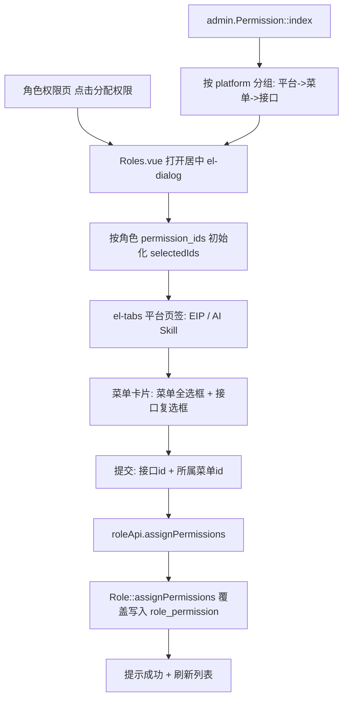

## 产品概述

优化后台「角色权限 → 分配权限」交互与权限分组：将右侧窄抽屉改为居中对话框（约占屏宽 2/5），权限按「平台页签 → 功能菜单 → 接口」三级分组展示，并补齐 AI Skill（知识库/技能库）缺失接口的权限归类。

## 核心功能

- **弹窗形态改造**：原右侧 380px 抽屉改为屏幕居中弹出，宽度约屏宽 2/5（40%），高度充裕、内容区内部滚动，一屏可见更多菜单与接口。
- **平台页签分组**：顶层按平台分页签——EIP 页签下含 账号管理、角色权限、应用链接、公告管理、门户背景；AI Skill 平台页签下含 AI Skill 管理、Skill 分类。
- **菜单卡片式勾选**：每个页签内按菜单分卡片，卡片头为菜单名并带「全选/半选」复选框，下方罗列该菜单下的接口复选框；勾选菜单即联动其全部接口。
- **知识库（应用链接）归类**：门户「内部Wiki - 企业知识库」所属的应用链接接口（list/create/update/delete）已归在「应用链接」菜单下，新结构确保其在 EIP 页签的「应用链接」菜单标签内完整展示。
- **AI Skill 缺失接口补录**：新增 ai-skill:create、ai-skill:parse-zip、ai-skill:stats、ai-skill:like 权限行归入「AI Skill 管理」菜单，并在路由绑定 PermissionCheck；同时把「员工自助类」权限预授予普通用户角色，保证员工仍可自助创建/点赞 Skill。

## 技术栈

- 后端：ThinkPHP（PHP）+ MySQL，沿用 `resp_ok`/`resp_fail`、Phinx 迁移与 Seeder、`password_hash` 等既有设施；PHP 需使用 `h:\XAMPP\php\php.exe`（PATH 中无 php）。
- 前端：Vue 3 + TypeScript + Vite + Element Plus（el-dialog / el-tabs / el-checkbox-group）+ Pinia + lucide-vue-next，无新增依赖。
- 沿用请求层 `frontend/src/api/request.ts`（自动注入 Token、非 0 码统一提示），前端仅 `.catch(console.error)`。

## 实现方案

采用「后端补 platform 归属并按平台分组返回 + 前端居中弹窗页签化」：

1. **后端分组**：给 `permission` 表新增 `platform` 列（默认 `eip`），迁移与 Seeder 均幂等；`Permission::index()` 改为按 platform 分组返回「平台 → 菜单 → 接口」结构，platform 内沿用 `sort`/`id` 排序。
2. **前端弹窗**：`el-drawer` → `el-dialog`（`width="40%"`、`align-center` 居中、`destroy-on-close`），内部 `el-tabs` 按平台分页签，页签内按菜单卡片渲染复选框组。
3. **勾选状态单源**：以 `selectedIds: Set<number>` 为唯一状态源（不再依赖 el-tree 的 checked/halfChecked），打开时用角色已有 `permission_ids` 取交集初始化；提交时汇总「已勾选接口 id + 其所属菜单 id」——与现有一致，后端 `assignPermissions` 接受菜单 id（经 `Permission::whereIn` 校验）。

### 关键决策与权衡

- **新增 platform 列而非改 `type` 枚举**：`type` 为 `enum('menu','api')`，塞入 platform 需改枚举且污染权限语义；独立列更清晰，且「平台」纯为分组属性、不参与授权判定。
- **不用多 el-tree + 页签切换**：切页签会导致未打开页签的 tree ref 缺失、提交时丢失其勾选；改为单源 `selectedIds` + 卡片复选框，状态完整可控、无半选丢失风险。
- **补录权限同时预授权普通用户**：Skill 控制器当前允许任意登录用户创建/点赞/解析 zip，直接绑权限会阻断员工自助；故把自助类权限（create / parse-zip / like / stats / list）在 Seeder 中预授予 `role_id=2`，管理类（update / delete / publish / category）仅超管与按需分配，行为等价且可控。
- **迁移与种子属写库操作**：执行前需用户确认；Seeder 保持既有幂等风格（按 code 去重、超管自动获得新权限）。

### 数据流



## 实现要点

- **迁移**：新增 `platform` 列（string，默认 `eip`，非 null），`down()` 中删除；迁移文件命名沿用 `YYYYMMDDHHMMSS_` 前缀。
- **Seeder 幂等**：`InitDataSeeder`（EIP 四菜单）与 `AiSkillSeeder`（id 60/70 段）按 code 去重写入；新增权限行放 `AiSkillSeeder`（harness 已有「按 code 去重 + 超管自动授权」逻辑）；platform 归属用 `Db::name('permission')->where('code','like','ai-skill%')->update(['platform'=>'skill'])` 之类幂等更新。
- **Permission::index 返回结构**：`[{ platform, name, menus: PermissionNode[] }]`，menus 内含 `children`（接口），保持 `type/path/code` 字段不变，避免破坏既有字段语义。
- **前端类型**：`types/index.ts` 新增 `PermissionPlatform { platform: string; name: string; menus: PermissionNode[] }`；`roleApi.permissionTree()` 返回类型同步更新。
- **弹窗细节**：`width="40%"`（Element Plus 百分比基于视口宽，约为屏宽 2/5）、`align-center` 垂直居中、内容区 `max-h-[60vh] overflow-y-auto`；菜单卡片头复选框用 `indeterminate` 表达部分勾选。
- **提交防错**：仍校验 `drawerRole` 存在；提交后关闭弹窗、提示并刷新列表；错误由拦截器统一提示。

## 目录结构

```
backend/database/migrations/
└── 2026xxxx_add_permission_platform.php   # [NEW] permission 表新增 platform 列（默认 'eip'），down() 中可回滚
backend/database/seeds/
├── InitDataSeeder.php                     # [MODIFY] 幂等补全 EIP 菜单/接口的 platform='eip'（或依赖列默认值）
└── AiSkillSeeder.php                      # [MODIFY] 幂等设置 ai-skill 相关行 platform='skill'；新增 ai-skill:create/parse-zip/stats/like 权限行（parent 60）；自助类预授予 role_id=2
backend/app/controller/admin/
└── Permission.php                         # [MODIFY] 构建菜单树后按 platform 分组返回「平台→菜单→接口」
backend/route/
└── app.php                                # [MODIFY] skills 相关路由绑定 PermissionCheck（create/parse-zip/like/stats/categories；管理类沿用既有判定）
frontend/src/types/
└── index.ts                               # [MODIFY] 新增 PermissionPlatform 类型
frontend/src/api/
└── index.ts                               # [MODIFY] roleApi.permissionTree 返回类型改为 PermissionPlatform[]
frontend/src/views/admin/
└── Roles.vue                              # [MODIFY] 抽屉→居中 el-dialog(40%)；平台页签 + 菜单卡片勾选；selectedIds 单源状态与提交逻辑
```

## 关键代码结构

```ts
// frontend/src/types/index.ts —— 新增
export interface PermissionPlatform {
  platform: string
  name: string
  menus: PermissionNode[]
}
```

```ts
// frontend/src/views/admin/Roles.vue —— 状态与提交契约（概要）
const selectedIds = ref<Set<number>>(new Set())
const isMenuChecked = (menu: PermissionNode): boolean // 全部接口已选
const isMenuIndeterminate = (menu: PermissionNode): boolean // 部分接口已选
const toggleMenu = (menu: PermissionNode, checked: boolean): void // 联动其全部接口
const submitAssign = (): void // 汇总 selectedIds（含被勾选接口及其所属菜单 id）
```

## 设计风格

延续门户与后台既有克制、对齐的视觉语言：白底卡片、圆角、轻阴影、品牌蓝紫渐变点缀，不引入新视觉体系。

## 弹窗结构（自上而下）

1. **标题栏**：居中弹窗，`width="40%"`（约屏宽 2/5）并垂直居中；标题「分配权限 - {角色名}」，右上角关闭图标。
2. **平台页签**：顶部 `el-tabs`，页签为「EIP」「AI Skill 平台」，选中态用品牌主色下划线，切换无跳动。
3. **菜单卡片区**：页签内纵向排列菜单卡片（白底、`rounded-xl`、浅边框）；卡片头为菜单名 + 「菜单/接口」标签 + 全选复选框（支持半选态），下方为接口复选框网格（每行 2 列），接口项显示名称与编码/路径灰字。
4. **底部操作区**：右对齐「取消」+「确定」，确定为主色实心按钮，提交时 loading 并禁用防重复；内容区超高时内部滚动，操作区固定可见。

## 交互与动效

复选框 hover 浅灰底、选中主色；菜单全选联动子项带轻微过渡；弹窗沿用 Element Plus 默认淡入缩放动效；页签切换平滑；接口项聚焦态主色描边。校验与保存失败由全局提示条反馈，不打断填写。

## Agent Extensions

### Skill

- **编程专家.Skill**
- Purpose：指导本次跨前后端 + 数据库迁移改造的方案、实现、验证与安全边界（权限模型变更、员工自助不中断）
- Expected outcome：交付居中弹窗 + 平台页签分组 + AI Skill 权限补录，并给出可复现的验证证据与已知限制

### SubAgent

- **code-explorer**
- Purpose：核对 permission 表字段、Seeder 幂等写法与 Skills 路由鉴权现状，避免改动遗漏调用方
- Expected outcome：输出受影响文件与调用点清单，供实现前复核