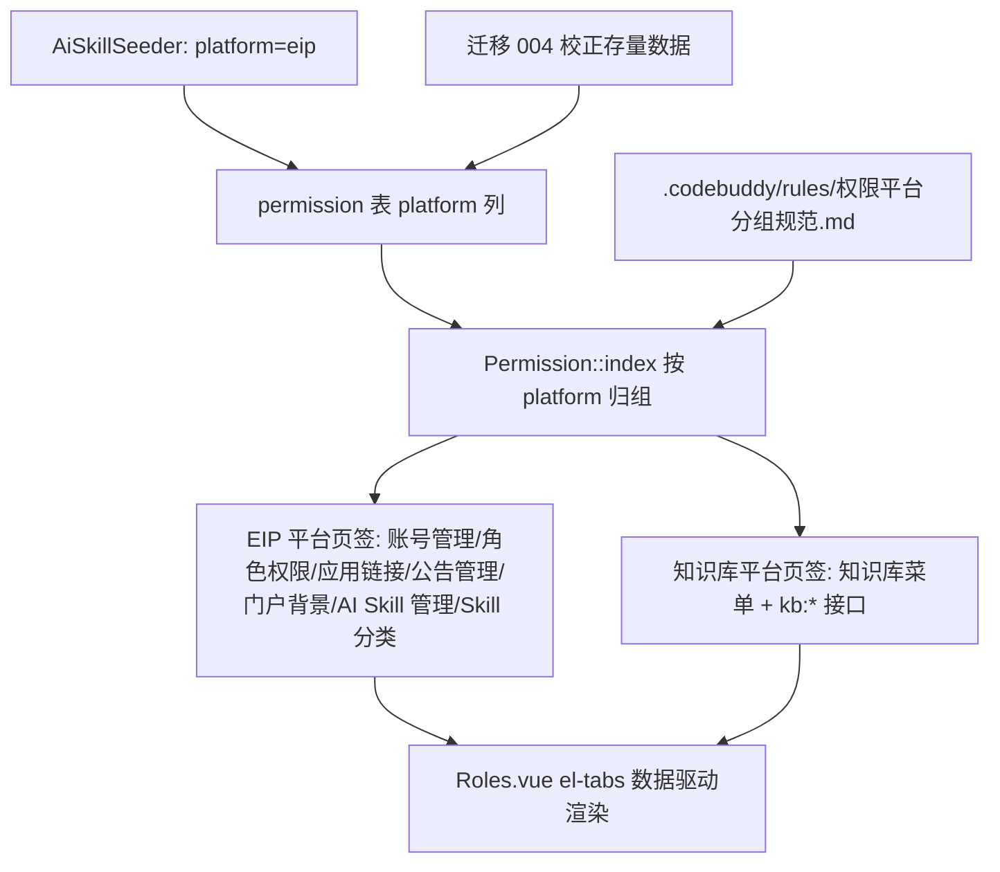

## 用户需求

调整「分配权限」弹窗的平台页签归属，并把判定规则固化为项目规范：

1. **知识库平台单独一个页签**：该页签内的权限属于 InuWiki（独立知识库产品）。
2. **AI Skill 平台的权限配置归到 EIP 平台页签**：因为 AI Skill 功能是开发在 EIP 代码库里的。
3. **更新项目规范**：后续还会开发别的平台，规范需说明平台归属的判定规则与新增平台的标准步骤。

## 规则提炼（本次要固化的判定标准）

判定依据是「该功能是否开发在 EIP 代码库内」：

- 在 EIP 代码库（`INUEIP`）内开发的功能 → 归入 **EIP 平台**页签（`platform=eip`），例如 账号管理、角色权限、应用链接、公告管理、门户背景、AI Skill（`backend/app/controller/Skill.php`、`frontend/src/views/admin/AiSkills.vue` 均在 INUEIP 内）。
- 独立产品/独立代码库与独立部署的平台 → **独占一个平台页签**（`platform` 取独立值），例如 知识库 InuWiki（`INUWIKI` 独立代码库，权限码 `kb:*`）。

## 核心功能

- 页签变为两个：**EIP 平台**（含 账号管理、角色权限、应用链接、公告管理、门户背景、AI Skill 管理、Skill 分类）与 **知识库平台**（含 知识库菜单及其 8 个接口）。
- 权限数据 `platform` 值校正：AI Skill 与 Skill 分类相关权限由 `skill` 改为 `eip`；知识库菜单（`system:kb`）及其下 `kb:*` 权限由 `eip` 改为 `kb`。
- 新增项目规范文档，明确判定规则、当前平台清单、以及「新增平台」的标准操作步骤，支撑后续继续接入新平台。

## 技术栈

- 后端：ThinkPHP（PHP）+ MySQL。沿用既有 `resp_ok`、Phinx 迁移与 Seeder；PHP 用 `h:\XAMPP\php\php.exe`（PATH 中无 php）。
- 前端：Vue 3 + TypeScript + Element Plus。**本次前端无需改动**——页签由后端返回的 `PermissionPlatform[]` 数据驱动（`el-tabs` 的 `:label="platform.name"`、`:name="platform.platform"`）。
- 规范文档：Markdown，置于 `.codebuddy/rules/`，与已有 `门户顶栏规范.md` 风格一致。

## 实现方案

采用「一条幂等校正迁移 + 后端平台常量调整 + Seeder 默认值对齐 + 规范文档」四步：

1. **数据校正（存量库）**：新增迁移 `20260927000400_align_permission_platform.php`，按权限 `code` 批量更新 `platform`——`ai-skill:*` 与 `skill-category:*` 置为 `eip`；`system:kb` 菜单及其下 `kb:*` 置为 `kb`。已执行的迁移 003（`set_ai_skill_platform`）**不修改**，由本次迁移统一纠正，保证「存量库」与「全新安装」结果一致。
2. **后端平台常量**：`Permission.php` 的 `PLATFORMS` 由 `['eip','skill']` 改为 `['eip' => 'EIP 平台', 'kb' => '知识库平台']`（顺序即页签顺序）；保留 `DEFAULT_PLATFORM='eip'` 兜底，使历史遗留或未识别的 `platform`（如残留 `skill`）回落到 EIP 平台，**避免权限在界面上丢失**。
3. **Seeder 默认值（全新安装）**：`AiSkillSeeder.php` 中给权限行附加的 `['platform' => 'skill']` 改为 `['platform' => 'eip']`，使全新安装时 AI Skill 直接落在 EIP 平台。
4. **规范文档**：新增 `.codebuddy/rules/权限平台分组规范.md`，写清判定规则、当前平台清单、新增平台步骤与注意事项。

### 关键决策与权衡

- **platform 键值取 `kb` 而非 `inuwiki`**：与既有权限码前缀 `kb:*`（`kb:article:*`、`kb:space:manage`、`kb:category:manage`、`kb:media:upload`）一致，且页签展示名「知识库平台」由 `PLATFORMS` 的中文值单独控制，键值与展示名解耦。键值一经使用即作为页签 key，**不可随意更改**（否则历史角色授权与分组会错位）。
- **不删除 `skill` 这个历史值、而是靠兜底回落**：直接物理清理风险高且无收益；只要 `PLATFORMS` 不再注册它，未知值就会回落 `eip`，既保证界面干净又不丢权限。
- **迁移而非改已执行迁移**：已执行迁移再改会导致「已执行环境的库」与「迁移文件」不一致，是典型的半迁移状态；新增一条幂等迁移是本项目既有做法（见 001/002/003）。
- **前端零改动**：页签完全数据驱动，改后端常量即生效，改动面最小。

## 实现要点

- 迁移用 `think\facade\Db` 按 `code` 批量 `update`，并同步 `updated_at`；`down()` 反向还原（AI Skill 回 `skill`、知识库回 `eip`），保持可回滚。
- 不要在 Seeder 内混用 Phinx `$this->table()->insert()` 与原生 `Db` 更新同一张表（本轮已踩坑：会互相等待行锁导致 `1205 Lock wait timeout`）。平台归属的批量更新统一放在迁移里。
- `Permission.php` 的分组逻辑保持现状：先按 `parent_id` 递归构树（菜单 → 接口），再按每条**顶层菜单**的 `platform` 归组；接口继承所属菜单的平台，无需单独维护。
- 知识库菜单顶点要求 `parent_id=0` 且自身带 `platform='kb'`，其接口挂在它之下——新增平台时同样遵循「一个菜单顶点 + 若干接口子节点」结构。
- 权限 id 分配避开已占用段（75–82 为 kb、60–64/70–74/85–89 为 AI Skill），新增权限继续向后取空闲 id。

## 架构设计



平台归属的唯一数据源是 `permission.platform`；`Permission.php` 的 `PLATFORMS` 决定「有哪些页签、叫什么名字、什么顺序」；前端只消费分组结果。新增平台只需改这两处 + 数据，不动前端。

## 目录结构

```
backend/database/migrations/
└── 20260927000400_align_permission_platform.php  # [NEW] 幂等校正：ai-skill/skill-category → eip；system:kb 与 kb:* → kb；down() 可回滚
backend/app/controller/admin/
└── Permission.php                                # [MODIFY] PLATFORMS 改为 ['eip'=>'EIP 平台','kb'=>'知识库平台']，保留未知值回落 eip 的兜底
backend/database/seeds/
└── AiSkillSeeder.php                             # [MODIFY] 新权限 platform 由 'skill' 改为 'eip'（保证全新安装落 EIP 平台）
.codebuddy/rules/
└── 权限平台分组规范.md                            # [NEW] 平台归属判定规则、当前平台清单、新增平台标准步骤与注意事项
```

## 关键代码结构

```
// backend/app/controller/admin/Permission.php —— 平台页签定义（顺序即页签顺序）
private const PLATFORMS = [
    'eip' => 'EIP 平台',
    'kb'  => '知识库平台',
];
/** 默认平台：未标记或取值未注册时回落，避免权限在界面丢失 */
private const DEFAULT_PLATFORM = 'eip';
```

```
// backend/database/migrations/20260927000400_align_permission_platform.php —— 校正范围（按 code，幂等）
private const EIP_CODES = [
    'ai-skill:manage-all', 'ai-skill:list', 'ai-skill:update', 'ai-skill:delete', 'ai-skill:publish',
    'ai-skill:create', 'ai-skill:parse-zip', 'ai-skill:like', 'ai-skill:stats', 'ai-skill:categories',
    'ai-skill:category', 'skill-category:list', 'skill-category:create', 'skill-category:update', 'skill-category:delete',
];
private const KB_CODES = [
    'system:kb', 'kb:article:list', 'kb:article:create', 'kb:article:update', 'kb:article:delete',
    'kb:article:publish', 'kb:category:manage', 'kb:space:manage', 'kb:media:upload',
];
// up(): EIP_CODES → platform='eip'；KB_CODES → platform='kb'
// down(): 反向还原
```

## Agent Extensions

### Skill

- **编程专家.Skill**
- Purpose：指导本次平台归属调整与规范沉淀，确保判定规则准确、迁移幂等可回滚、不因平台调整导致权限丢失
- Expected outcome：页签正确分为 EIP 平台与知识库平台，AI Skill 归入 EIP，规范文档可指导后续新增平台

### SubAgent

- **code-explorer**
- Purpose：复核 `permission` 表中 AI Skill、知识库相关权限的 `code`/`platform` 现状与 `Permission.php` 分组实现，确认校正范围无遗漏
- Expected outcome：输出待校正权限清单与受影响调用点，供实现前复核