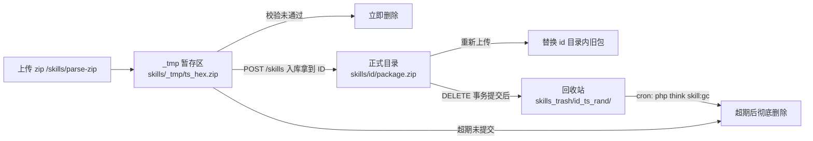

## 用户需求

后端保存 Skill 压缩包的目录格式需要重构，并实现删除时的磁盘回收策略。

## 产品概述

当前后端把上传的 Skill 压缩包**平铺**堆在 `uploads/skills/` 下（文件名 `时间戳_随机串.zip`），Skill 与磁盘文件之间没有一一对应关系，且删除 Skill 时只删数据库记录、磁盘文件完全不动，导致孤儿文件堆积。本次要把存储改为「一个 Skill 对应一个以数据库 ID 命名的文件夹」，并让后台删除操作把该文件夹移入统一回收站，由定时任务按保留期清理。

## 核心功能

- **一一对应的目录结构**：每个 Skill 一个文件夹，文件夹名取自数据库 `ai_skill.id`，如 `uploads/skills/101/package.zip`；文件夹内只放原始 zip，不做解压。
- **两段式落盘**：上传解析发生在入库之前（此时无 ID），先落到暂存区 `skills/_tmp/`，待保存拿到 ID 后再归位到 `skills/{id}/`。
- **编辑换包**：重新上传时新包归位到同一 `{id}` 目录，旧包被替换清理，不再产生孤儿文件。
- **删除进回收站**：后台删除 Skill 时，数据库事务**提交之后**把整个 `{id}` 目录整体 `rename` 到回收站 `uploads/skills_trash/{id}_{时间戳}_{随机}/`，原子完成且可在保留期内恢复。
- **定时清理**：提供 `skill:gc` 命令，清理超期回收站目录与超期暂存文件，并报告孤儿目录；Ubuntu 上配每日 cron。
- **历史数据迁移**：一次性把现有 8 个平铺 zip 按数据库记录归位到 `{id}/`，无对应记录的孤儿文件移入回收站而非直接删除。
- **路径规范化**：数据库中 `package_path` 改为只存相对路径 `skills/{id}/package.zip`，前端展示时再拼接访问前缀。

## 技术栈

- 后端：ThinkPHP 8 + PHP 8（现有 `backend/app/controller/Skill.php`、`app/service/`、`config/console.php`）
- 存储：本地磁盘 `upload.root`（`backend/public/uploads`），生产为 Ubuntu
- 数据库：MySQL（表 `inue_ai_skill`，字段 `package_path` varchar(500)，**本次无表结构变更**）
- 前端：Vue3 + TS（仅详情页展示路径拼接的最小改动）
- 配置：全部经 `backend/config/myconfig.php` 单一配置源（项目强制规范）

## 实现方案

### 核心思路

采用「暂存 → 归位 → 回收」三段式文件生命周期管理，并把全部文件操作封装到 `SkillStorage` 服务，控制器只做编排。

关键决策：

1. **为什么必须两段式**：`POST /skills/parse-zip` 在入库前执行，此刻没有 ID，无法直接建 `{id}` 目录。因此解析后先落 `skills/_tmp/{ts}_{hex}.zip`，返回暂存**相对路径**给前端（继续复用 `package_path` 字段，前端改动最小）；`POST /skills` 拿到自增 ID 后再 `rename` 归位到 `skills/{id}/package.zip` 并回写 `package_path`。
2. **为什么选回收站 + 定时清理（用户已采纳）**：删除时只做一次**目录级 `rename()`**——同分区内是原子操作且瞬时完成，不存在「删一半」的中间态；配合保留期可在误删或代码缺陷时恢复。相比直接从磁盘删除，回收站方案唯一的代价是磁盘增长到清理周期，由 cron 兜底。
3. **为什么文件操作必须放在事务外**：`delete()` 的 DB 操作在 `Db::transaction` 内，若把文件移动放进事务，一旦事务回滚文件已不可恢复。因此先提交事务、成功后再移动目录，失败则完全不动磁盘。
4. **回收站必须与正式目录同分区**：否则 `rename()` 会退化为「复制 + 删除」，失去原子性。部署时需在 Ubuntu 上确认两者位于同一文件系统，并让 `www-data` 对两个目录可写。
5. **配置必须进 myconfig**：按项目规范，新增的回收站路径、暂存目录名、保留期、删除模式一律写入 `myconfig.skill`，业务代码不写死路径。

### 目录结构与生命周期



目标磁盘结构：

```
{upload.root}/
├── skills/
│   ├── _tmp/20260926_ab12cd.zip      # 暂存（GC 定期清理）
│   ├── 101/package.zip               # 一个 Skill = 一个以 ID 命名的文件夹
│   └── 102/package.zip
└── skills_trash/
    └── 101_20260926_1f3a9c/package.zip   # {原ID}_{时间戳}_{随机}
```

### 性能与可靠性要点

- 删除/归位均为单次 `rename()`，O(1) 且原子，无逐文件遍历、无 N+1 I/O。
- 列表接口不触碰磁盘，`decorate()` 只回传数据库中已存的相对路径，无额外 `stat` 开销。
- 路径校验统一走「白名单正则 + `realpath()` 包含性检查」，杜绝 `../` 目录穿越。
- 所有文件操作失败只记 warning 日志、不阻断接口，符合项目规范「缺失文件降级、禁止抛未捕获异常导致 500」。

## 实现注意事项（防回归）

- `AiSkill` 模型刚修复过 `params` 的 `'json'` 类型声明（本版本 think-orm 的 `getFields()` 不合并 `$json`，不加会触发 `Array to string conversion`），本次改动**不要动**该声明。
- `upload_dir('skill', $subDir)` 已支持子目录参数，可直接复用；新增回收站目录需新增辅助函数，不要硬编码。
- `parseZip()` 现有的「校验未通过则 `@unlink($saved)`」逻辑需迁移到暂存区，保证无效包不残留。
- 迁移脚本必须**幂等**（可重复执行），且孤儿文件只移入回收站、不直接删，避免不可逆。
- 改完必须 `php -l` 语法检查全部改动文件；myconfig 变更按规范需**单独列出并经用户确认后才可上传**。

## 架构设计

```
HTTP 请求 → Skill 控制器（编排）
                ↓
        SkillStorage 服务（唯一文件操作出口）
                ↓
        磁盘 skills/ 、skills/_tmp/ 、skills_trash/
                ↓
        SkillGc / SkillMigratePackages 命令（cron / 一次性）
```

- **控制器层**：`Skill.php` 负责校验与事务编排，`save`/`update`/`delete` 中的文件动作全部委托服务，文件操作一律在 DB 事务之外。
- **服务层**：`app/service/SkillStorage.php` 封装暂存、归位、丢弃、移入回收站、路径解析与校验、GC 清理，遵循现有 `AuthService`/`PurifierService` 的服务层约定。
- **命令层**：`app/command/SkillGc.php`（定时清理）、`app/command/SkillMigratePackages.php`（一次性历史迁移），注册进 `config/console.php`。
- **配置层**：`myconfig.skill` 新增回收站与保留期相关键；`common.php` 新增目录辅助函数。

## 目录结构

```
backend/
├── config/
│   ├── myconfig.php                     # [MODIFY] skill 分组新增：trash_path、temp_dir、
│   │                                    #   trash_retention_days、temp_retention_hours、delete_mode；
│   │                                    #   按规范补分组/键注释与枚举，php -l 自检
│   └── console.php                      # [MODIFY] 注册 skill:gc 与 skill:migrate-packages 命令
├── app/
│   ├── common.php                       # [MODIFY] 新增 skill 目录辅助函数（正式/暂存/回收站），
│   │                                    #   全部从 myconfig 取值，禁止硬编码路径
│   ├── controller/
│   │   └── Skill.php                    # [MODIFY] parseZip 落暂存区并返回相对暂存路径；
│   │                                    #   save 拿到 ID 后归位并回写 package_path；
│   │                                    #   update 区分「新暂存包/原路径不变」；
│   │                                    #   delete 事务提交后移入回收站；
│   │                                    #   isValidPackagePath 改为新结构正则 + realpath 校验
│   ├── service/
│   │   └── SkillStorage.php             # [NEW] 文件生命周期服务：暂存、归位、替换旧包、丢弃、
│   │                                    #   移入回收站、路径解析与包含性校验、GC 清理
│   └── command/
│       ├── SkillGc.php                  # [NEW] php think skill:gc：清理超期回收站与暂存文件，
│       │                                #   报告孤儿目录；支持 --dry-run
│       └── SkillMigratePackages.php     # [NEW] php think skill:migrate-packages：一次性把历史
│                                        #   平铺 zip 按 ID 归位并重写 package_path，幂等，
│                                        #   孤儿文件移入回收站
└── public/uploads/skills/               # [AFFECTED] 现有 8 个平铺 zip 待迁移
frontend/src/
├── components/SkillDetailDrawer.vue     # [MODIFY] 资源包展示改为「访问前缀 + 相对路径」拼接
├── mock/skill.ts                        # [MODIFY] 包路径改为与新结构一致的相对路径
└── types/index.ts                       # [MODIFY] package_path 注释更新为相对路径语义
```

## 关键代码结构

`SkillStorage` 服务对外契约（接口级定义，供实现对齐）：

```
class SkillStorage
{
    /** 把已落盘的上传文件移入暂存区，返回相对路径 skills/_tmp/{name}.zip */
    public function stash(string $savedFile, string $filename): string;

    /** 把暂存包归位到 skills/{id}/package.zip；返回最终的相对路径 */
    public function commit(int $skillId, string $relativeTempPath): ?string;

    /** 删除 Skill 后把整个 {id} 目录移入回收站（事务外调用），返回是否成功 */
    public function moveToTrash(int $skillId): bool;

    /** 相对路径 → 绝对路径，含 realpath 包含性校验，非法返回 null */
    public function resolve(string $relativePath): ?string;

    /** GC：清理超期回收站目录与超期暂存文件，返回统计数组 */
    public function gc(int $trashDays, int $tempHours, bool $dryRun = false): array;
}
```