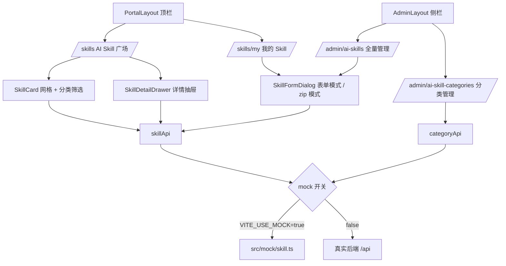

## 产品概述

在现有「吟游廊 EIP 平台」之上新增**企业内部 AI Skill 管理平台**模块：所有 Skill 按「职能 + 类型」双维度分类归档；每位员工可在门户侧上传（在线表单或 zip 包）并管理自己上传的 Skill；管理员在后台管理全量 Skill 与分类体系。

## 核心功能

- **AI Skill 广场（门户）**：卡片网格浏览全部已上架 Skill，支持职能分类筛选、类型筛选、关键词搜索、排序；卡片展示图标、名称、一句话描述、职能标签、作者；点击查看详情（提示词正文、参数、来源方式）并可执行「使用/复制」。
- **我的 Skill（门户）**：仅展示当前登录者上传的 Skill，含状态统计（全部/已上架/草稿/已下架）；支持新建、编辑、上架/下架、删除（二次确认）；其他人 Skill 只可浏览不可操作。
- **Skill 上传（两种模式）**：
- 表单模式：填写名称、图标、职能分类、类型分类、描述、提示词正文、参数列表（名称/说明/必填）后直接创建；
- 压缩包模式：上传 zip，展示校验结果面板（必须含根目录 `SKILL.md`，可选 `scripts/`、`resources/`，限制体积与文件数），校验通过后回填表单字段再提交。
- **后台全量管理**：管理员表格视图查看全部 Skill（含作者列），可编辑任意 Skill、上下架、删除；按职能/类型/状态/作者筛选分页。
- **分类管理**：管理员维护职能分类（研发/人事/财务/市场/法务/运营…）与类型分类（文档处理/数据分析/代码助手/流程自动化/知识问答…），含名称、图标、排序、启停。
- **权限边界**：员工仅管理自己的；管理员管理全部；无权限场景给出明确提示而非静默失败。

## 明确不做（本期范围外）

审核流、版本历史、可见范围（私密/部门）、使用统计与调用量。

## 视觉效果

沿用平台既有视觉语言：白卡 `rounded-2xl bg-white shadow-card`，主色 `#5B8FF9` → `#7A6FF0` 渐变，卡片 hover 抬升阴影；广场页为卡片瀑布网格 + 左侧职能分类导航，详情页为右侧抽屉；后台为表格式管理页，与现有「应用链接/公告管理」页保持一致的布局节奏与交互范式。

## 技术栈

沿用现有平台技术栈，不引入新依赖：

- 前端：Vue 3（`<script setup lang="ts">`） + Vite 5 + Element Plus + Pinia + Tailwind CSS 3（令牌：`primary #5B8FF9` / `primary-deep #3B6FE0` / `primary-purple #7A6FF0` / `ink #1F2D3D` / `ink-sub #5E6D82` / `ink-mute #9099A8` / `page #EEF2FB`）
- 图标：`lucide-vue-next`（已依赖，经 `components/LucideIcon.vue` 动态渲染）
- 数据：本期后端接口未实现，走**前端 mock**（`src/mock/skill.ts` + `VITE_USE_MOCK` 开关），保持 api 层函数签名与 `{code,msg,data}` / `PageResult<T>` 契约不变，后端就绪后仅切换开关即可

## 实现方案

### 关键约束（已由代码确认，必须遵守）

1. `frontend/src/router/index.ts` 的守卫规定：访问 `/admin/*` 必须 `store.isAdmin`，且校验 `meta.perm`。普通员工（如 `zhangsan`）无任何权限码 → **无法进入后台**。因此「我的 Skill」「广场」必须挂在**门户路由**（`/` → `PortalLayout`）下，不能放后台。
2. `AdminLayout.vue` 菜单按 `store.hasPermission(perm)` 过滤；后台侧栏固定 `w-56`、主区 `ml-56`、顶栏 `h-16`、标题取 `route.meta.title`。
3. `.codebuddy/rules/门户顶栏规范.md` 要求：门户新页面必须作为 `PortalLayout` 的 `router-view` 子页并保留顶栏；新增门户级入口需以「图标 + 文字按钮」形式加入顶栏；**不引入新的视觉语言或额外依赖**。

### 架构设计



- **视图层**：门户 2 页 + 后台 2 页，各自只承担一个主目标（广场=发现，我的=治理，后台=管控，分类=体系维护）。
- **组件层**：`SkillCard`（广场卡片，复用于首页推荐位）、`SkillDetailDrawer`（详情抽屉，广场/我的/后台共用）、`SkillFormDialog`（新建/编辑，含表单与 zip 双模式）、`SkillCategoryNav`（职能分类导航）。复用现有 `IconPicker.vue`、`LucideIcon.vue`。
- **数据层**：`api/index.ts` 新增 `skillApi`（list/my/create/update/remove/up/off/uploadZip/parseZip）与 `categoryApi`（list/create/update/remove）；`types/index.ts` 新增 `SkillItem`、`SkillCategory`、`SkillParam`、`SkillSource`。

### 关键取舍与技术决策

| 决策 | 选择 | 理由 |
| --- | --- | --- |
| mock 注入方式 | 在 `api/index.ts` 内按 `import.meta.env.VITE_USE_MOCK` 分支返回 mock，不改 `api/request.ts` | 拦截器已统一处理 401/错误消息，改动它会波及全站；api 层签名不变便于后端平替 |
| zip 目录校验 | **不引入 JSZip**：客户端仅校验扩展名/体积/文件数，上传后由「后端解析」返回目录树与校验结论（原型期 mock 返回） | 遵守「不引入额外依赖」规则；且与真实服务端解析职责划分一致，避免前端假校验误导 |
| 权限码 | 后台用 `ai-skill:manage-all`、`ai-skill:category`；员工自管理不依赖权限码，按 `owner_id === 当前用户` 在前端判定 | 与现有 RBAC（`system:*`）一致；员工侧不落在后台路由，规避 `/admin` 守卫限制 |
| 状态模型 | `status: 0 草稿 / 1 已上架 / 2 已下架`，无审核态 | 契合「基础：分类 + 上下架」的范围确认，避免过度设计 |
| 首页入口 | 顶栏新增「AI Skill」按钮（`/skills`）+ 首页新增「热门 Skill」推荐卡区块 | 双入口，符合门户规范中「新增导航入口延续顶栏模式」的要求 |


### 注意事项（防回归）

- 新后台权限码未进后端权限树前，仅超管可见菜单；原型期用 `admin` 演示，需在设计文档中标注「需补 seed 权限码」。
- 所有列表页必须实现加载/空/错误/无权限四种状态；删除走 `ElMessageBox.confirm` 二次确认（与 `AppLinks.vue` 一致）。
- 分页与筛选参数统一 `{page,size,keyword,category,type,status}`，沿用 `PageResult<T>`。
- mock 数据需覆盖多作者场景（含其他人的 Skill），以验证「只可管理自己」的权限边界。

## 目录结构

```
frontend/
├── src/
│   ├── types/index.ts                        # [MODIFY] 新增 SkillItem / SkillCategory / SkillParam / SkillSource 类型定义
│   ├── api/index.ts                          # [MODIFY] 新增 skillApi（list/my/create/update/remove/up/off/uploadZip）与 categoryApi（list/create/update/remove），按 VITE_USE_MOCK 分流
│   ├── mock/skill.ts                         # [NEW] Skill 与分类的 mock 数据 + 增删改查/上下架/zip 解析的内存实现（含多作者数据）
│   ├── router/index.ts                       # [MODIFY] 门户新增 /skills、/skills/my；后台新增 /admin/ai-skills、/admin/ai-skill-categories 及 meta.perm
│   ├── layout/PortalLayout.vue               # [MODIFY] 顶栏新增「AI Skill」导航按钮（图标+文字，激活态沿用现有样式）
│   ├── layout/AdminLayout.vue                # [MODIFY] menus 数组新增两项（Bot/Sparkles 图标 + perm 权限码）
│   ├── views/portal/Skills.vue               # [NEW] AI Skill 广场：职能分类导航 + 类型筛选 + 搜索 + 卡片网格 + 详情抽屉
│   ├── views/portal/MySkills.vue             # [NEW] 我的 Skill：状态统计 + 表格/卡片管理 + 新建/编辑/上下架/删除
│   ├── views/admin/AiSkills.vue              # [NEW] 后台全量管理：表格 + 作者列 + 筛选分页 + 编辑/上下架/删除
│   ├── views/admin/AiSkillCategories.vue     # [NEW] 分类管理：职能/类型双 Tab，表格增删改 + 排序 + 启停
│   ├── components/SkillCard.vue              # [NEW] Skill 卡片（图标/名称/描述/职能标签/作者/状态角标），hover 抬升
│   ├── components/SkillDetailDrawer.vue      # [NEW] 详情抽屉：提示词正文、参数表、来源方式、作者与时间
│   ├── components/SkillFormDialog.vue        # [NEW] 新建/编辑弹窗：表单模式 ↔ zip 上传模式切换、参数列表动态增删、校验结果面板
│   ├── components/SkillCategoryNav.vue       # [NEW] 职能分类导航（含「全部」与各分类计数）
│   └── views/portal/Home.vue                 # [MODIFY] 新增「AI Skill 推荐」区块（复用 SkillCard，无数据时整块隐藏）
└── docs/
    └── ai-skill-platform-design.md           # [NEW] 设计方案文档
docs/ai-skill-platform-design.md              # [NEW] 设计方案：信息架构、页面地图、权限矩阵、分类体系、数据模型、状态机、上传流程、界面线框与交互状态
```

## 关键数据结构

```ts
/** 职能 + 类型双维分类 */
export interface SkillCategory {
  id: number
  name: string          // 如「研发」「文档处理」
  dimension: 'function' | 'type'   // 职能 / 类型
  icon: string          // lucide 图标名
  sort: number
  status: number        // 1 启用 0 停用
}

export interface SkillParam {
  name: string
  label: string
  required: boolean
}

export interface SkillItem {
  id: number
  name: string
  icon: string
  summary: string
  function_category_id: number
  type_category_id: number
  content: string            // 提示词正文 / SKILL.md 内容
  params: SkillParam[]
  source: 'form' | 'zip'     // 创建方式
  package_path: string | null // zip 包路径，source=zip 时有值
  owner_id: number
  owner_name: string
  status: 0 | 1 | 2          // 0 草稿 1 已上架 2 已下架
  created_at: string
  updated_at: string
}
```

## 设计风格

沿用平台现有「明亮企业门户 + 轻拟态白卡」语言：主色蓝紫渐变（#5B8FF9 → #7A6FF0）作为品牌与强调色，背景 #EEF2FB / #F5F7FA，内容承载于 `rounded-2xl` 白色卡片 + `shadow-card` 柔和投影，卡片 hover 切换 `shadow-card-hover` 并轻微上移。整体为**中等密度**（Medium），后台页可紧凑，门户广场偏宽松。圆角统一 12–16px，禁用装饰性分隔线，靠留白分区。

## 页面规划（4 个核心页面）

### 1. AI Skill 广场 `/skills`（门户）

- 顶栏：沿用 PortalLayout，新增「AI Skill」导航项（Sparkles 图标，激活态 `text-primary bg-blue-50`）。
- 分类导航条：职能分类横向胶囊按钮（全部 / 研发 / 人事 / 财务 / 市场 / 法务 / 运营），选中为渐变实心。
- 筛选与搜索区：关键词搜索框（Search 图标）+ 类型下拉 + 排序（最新/最热/名称）。
- Skill 卡片网格：响应式 2/3/4 列，卡片含渐变图标块、名称（16px/600）、一句话描述（14px，2 行截断）、职能 + 类型双标签、作者与更新时间；hover 抬升并显示「查看详情」。
- 空态：居中插图 + 「还没有 Skill，去上传第一个」引导按钮。

### 2. 我的 Skill `/skills/my`（门户）

- 统计条：4 个轻量统计块（全部 / 已上架 / 草稿 / 已下架），数字 24px/600。
- 工具条：搜索 + 状态筛选 + 右侧主按钮「上传 Skill」（渐变实心）。
- 列表区：表格视图，列含图标、名称、分类、来源（表单/zip 标签）、状态（彩色 dot + 文字）、更新时间、操作（编辑 / 上下架 / 删除）。
- 他人的 Skill 不出现在此页，删除走二次确认弹窗。

### 3. 后台 AI Skill 管理 `/admin/ai-skills`

- 与「应用链接」页同构：白卡容器 + el-tabs（全部/草稿/已上架/已下架）+ 右上角「新建」主按钮。
- 表格增「作者」列与职能/类型列，操作列编辑/上下架/删除（危险色）。
- 顶部统计卡：总数、已上架、本月新增、覆盖职能数。

### 4. 分类管理 `/admin/ai-skill-categories`

- 双 Tab（职能 / 类型），表格含图标、名称、排序、状态开关、操作；新增弹窗含名称、图标（复用 IconPicker）、排序、启停。

## 上传弹窗（核心交互）

- 顶部「表单创建 / 压缩包上传」分段切换（el-radio-button）。
- 表单模式：名称、图标、职能、类型、描述、提示词正文（多行）、参数列表（动态行：参数名/说明/必填，可增删）。
- zip 模式：拖拽上传区（虚线框，支持点击选择）→ 上传后展示校验结果面板：目录树预览（SKILL.md 必须存在、scripts/ 与 resources/ 可选）、逐项校验图标与文案、错误时红色阻断并提示原因，校验通过后自动回填名称/描述/正文并可再编辑。

## 交互状态

加载（el-table `v-loading` / 卡片骨架）、空态（插图 + 引导文案）、错误（可重试提示条）、无权限（明确文案，非静默）、删除确认（ElMessageBox）、成功（ElMessage）。

## 响应式

≥1440px 四列网格；1024–1440px 三列；768–1024px 两列；<768px 单列，抽屉改为全宽底部弹出，后台表格横向滚动、操作列固定右侧。

## Agent Extensions

### SubAgent

- **吟游廊EIP**
- Purpose：以「产品经理 + 资深全栈开发工程师」视角承接本模块的产品方案细化与 Vue3/Element Plus 页面代码实现，确保符合现有平台架构与既有页面范式
- Expected outcome：交付 4 个页面、4 个组件、类型与 mock 数据、路由与菜单接入，编译通过且可运行演示
- **code-explorer**
- Purpose：在实现前复核 `frontend/src` 下 api/types/router/layout/组件 的现有约定与可复用点
- Expected outcome：确认无遗漏的接入点（如首页区块、权限码、菜单数组），避免回归