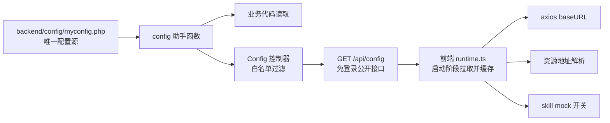

## 产品概述

为 INUEIP（吟游廊 EIP）项目建立一条可长期执行的工程规则：把平台所有配置项收敛到唯一文件 `backend/config/myconfig.php`，让 IP、端口、公告图、skill 文件等全部可自定义以适配正式环境，并约定我在每次「检查发布 / 上传 git」时必须输出的检查清单与确认流程。

## 核心功能

1. **单一配置源**：文件名 `myconfig.php`，位于 `backend/config/`，ThinkPHP 原生 PHP 数组格式；后续开发凡涉及可配置项，默认写入该文件，禁止散落到业务代码或新增其他配置文件。
2. **正式环境可配置**：站点信息、部署地址（协议/IP/域名/端口/API 与前端地址）、数据库、JWT、上传存储（本地 / CDN / 对象存储，决定公告图与门户背景图来源）、资源访问前缀、skill 文件来源（本地 / 远程 / 接口）、门户主题等全部可自定义；生产环境资源可不在本地，通过配置切换来源。
3. **前后端一份配置**：后端 myconfig.php 为唯一来源，新增免登录接口 `/api/config` 按白名单下发公开配置；前端应用启动阶段拉取并缓存，用于接口地址、资源地址、mock 开关等，杜绝前端硬编码 IP/端口。
4. **数据库变更双份交付**：表结构/数据变更同时产出 think-migration 迁移文件与 `docs/sql/` 下的增量 up/回滚 SQL 脚本，便于无 composer 的生产环境直接执行。
5. **发布检查流程**：我被要求检查发布或上传版本库时，必须分类列出需上传文件、排除敏感与产物文件、判定是否需要增量数据库脚本；若 myconfig.php 有变更，必须单独成节说明并**先向你确认能否上传**，未确认前不得提交或推送该文件。
6. **规则可细化**：规则以 Markdown 写入 `.codebuddy/rules/`，风格对齐现有 `门户顶栏规范.md`（适用范围 / 强制标准 / 例外条件），后续可持续追加条目。

## 用户已确认的决策

- myconfig.php 写全量真实值并入库，每次改动先经你确认。
- 前端配置由后端 `/api/config` 下发，不再各自维护端口与地址。
- 数据库变更采用「迁移文件 + SQL 增量脚本」双份交付。

## 技术栈

- 后端：ThinkPHP 8 / PHP 8.0 及以上，`backend/config/*.php` 返回数组形式配置，ThinkPHP 自动加载该目录全部配置文件，新增的 `myconfig.php` 可直接用 `config('myconfig.xxx')` 读取。
- 前端：Vite + Vue 3 + TypeScript + Tailwind，axios 实例在 `frontend/src/api/request.ts`，入口 `frontend/src/main.ts`。
- 数据库：MySQL + `topthink/think-migration 3.1` 迁移（`backend/database/migrations/`）。
- 规则载体：`.codebuddy/rules/` 下的 Markdown 规则文件（与现有 `门户顶栏规范.md` 同风格）。

## 实现方案

### 一、单一配置源 myconfig.php

文件类型定为 **PHP 数组配置**（与 ThinkPHP 现有 `config/` 目录完全一致，零学习成本、可被 `config()` 直接读取、支持注释分组）。分组设计：

- `site`：站点名称、版本号、版权、备案号。
- `deploy`：环境标识 `env`（local / production）、`api`（协议、域名或 IP、端口、对外 base_url）、`web`（前端对外地址）、`resource`（资源访问模式 local / cdn、资源 base_url）、`cors` 允许来源。
- `database` / `jwt`：连接与安全参数（真实值直写；个别超敏感项可选 `env()` 兜底覆盖）。
- `upload`：上传驱动（local / cdn / oss）、根目录、URL 前缀、大小与扩展名白名单。
- `announcement` / `portal_theme`：公告图与门户背景图的存放前缀与远程来源地址（现存量代码硬编码 `/uploads/announcement`、`/uploads/portal`，需改为读取配置）。
- `skill`：来源模式（local / remote / api）、本地路径、远程 base_url、接口端点、`use_mock` 开关。
- `portal`：门户首页相关默认值。
- `frontend_public`：白名单键名数组，声明哪些配置允许下发到前端。

**关键取舍**：用户选择"提交全量真实值入库"，因此不在文件层面做 env 分层，简单直接；但 `/api/config` 必须做白名单过滤，避免真实 IP、端口、密钥被公开接口暴露。

### 二、配置下发链路



### 三、后端接口

- 路由：在 `backend/route/app.php` 中，`Route::get('api/config', 'Config/publicConfig')` 必须写在 `Route::group('api', ...)->middleware(AuthCheck::class)` **之外**，保证免登录。
- 控制器：`backend/app/controller/Config.php`，方法读取 `myconfig.frontend_public.keys` 白名单，逐键取值组装返回；命中私密黑名单（密码、密钥、secret、数据库账号等）的键名直接剔除并记日志；统一使用项目 `resp_ok()` 输出（格式为 `code:0 / msg / data`）。
- 性能：结果可选走 ThinkPHP 缓存（生产环境建议开启，避免每次请求解析配置），前端只在应用启动时拉取一次，不产生额外请求放大。

### 四、前端接入

- 新增 `frontend/src/config/runtime.ts`：提供 `loadRuntimeConfig()`（应用启动阶段 await `GET /api/config`）与 `getRuntimeConfig()`、`resolveAssetUrl(path)`。
- 修改 `frontend/src/api/request.ts`：`baseURL` 改为读取运行时下发的 API 地址，取不到时回落到 `/api`（保证向后兼容与本地开发）。
- 修改 `frontend/src/api/index.ts`：`USE_SKILL_MOCK` 改由运行时 `skill.use_mock` 决定，保留 `VITE_USE_MOCK` 作为本地强制覆盖。
- 修改 `frontend/src/main.ts`：挂载应用前等待配置加载完成，失败则降级使用内置默认值，不阻断首屏。
- `frontend/vite.config.ts` 的 `http://127.0.0.1:8000` 仅影响本地开发代理（生产不走 dev server），改为读取 `VITE_DEV_PROXY_TARGET` 环境变量并保留原默认值，不改动生产行为。

### 五、数据库增量脚本规范

- `docs/sql/` 下按 `YYYYMMDDHHMM_{简述}.up.sql` 与同名 `.down.sql`（回滚）成对产出，与迁移文件一一对应。
- 脚本头部注释固定包含：适用版本、执行环境、影响表、是否幂等、回滚方式、对应迁移文件名。
- 生产执行顺序：先备份 → 执行 up → 校验 → 异常执行 down。

### 六、发布检查流程（规则核心）

我被要求"检查发布 / 上传 git"时固定执行：

1. 列出工作区与暂存区变更（含新增、修改、删除、未跟踪）。
2. 分类输出：业务代码 / 配置 / 数据库变更 / 静态资源 / 文档 / 构建产物。
3. 排除项校验：`.env`、`backend/runtime/`、`backend/vendor/`、`backend/public/uploads/`、`frontend/node_modules/`、`frontend/dist/`、`*.log`、`composer.lock` 等不得误入。
4. 数据库判定：`backend/database/migrations/` 有新增或改动 → 必须同时补齐 `docs/sql/` 的 up/down 脚本，并在清单中标注执行顺序。
5. **myconfig.php 变更单独成节**：列出具体变更项与影响，明确提示"该文件含正式环境真实配置（IP/端口/密钥/资源地址）"，并**先向你确认是否随本次上传**；未获明确确认前，不提交、不推送该文件。
6. 输出发布清单（对话中输出；如需留档写入 `docs/release/YYYYMMDD-发布说明.md`）。
7. 全流程**不自动 commit、不自动 push**，只给结论与命令建议，等待你确认。

## 实现要点

- 复用现有约定：新增配置沿用 ThinkPHP 数组风格；接口返回沿用 `resp_ok()` / `resp_fail()`；不引入新依赖。
- 白名单优先：`/api/config` 默认只下发 `site`、`deploy.web`、`deploy.resource`、`skill.use_mock`、`upload` 中的公开子集，数据库与 JWT 一律不下发。
- 向后兼容：所有运行时配置项都必须内置安全默认值，接口不可用时不阻断前端启动。
- 平滑收敛：存量硬编码（`request.ts` 的 `/api`、`api/index.ts` 的 mock 开关、`vite.config.ts` 的代理目标、`PortalTheme` / `Announcement` 的图片前缀常量）改为读配置，但不改变现有默认行为，避免破坏已上线数据中的相对路径。
- 影响面控制：不改动现有路由权限模型，`/api/config` 为唯一新增公开接口；不改动现有 `.gitignore` 的忽略策略（myconfig.php 按用户决策入库）。

## 目录结构

```
.codebuddy/rules/
└── 统一配置与发布规范.md          # [NEW] 规则主文件：myconfig 单一配置源约定、正式环境可配置约定、发布检查流程（含 myconfig 变更必须确认条款）。风格对齐 门户顶栏规范.md

backend/
├── config/
│   └── myconfig.php               # [NEW] 全平台唯一配置文件（PHP 数组）。含 site / deploy / database / jwt / upload / announcement / portal_theme / skill / portal / frontend_public 分组，写真实值并入库
├── app/controller/
│   └── Config.php                 # [NEW] 公开配置控制器。按白名单读取 myconfig 并输出，过滤私密键，沿用 resp_ok 响应
└── route/
    └── app.php                    # [MODIFY] 在 AuthCheck 分组之外新增免登录路由 GET api/config

frontend/src/
├── config/runtime.ts              # [NEW] 运行时配置模块：loadRuntimeConfig / getRuntimeConfig / resolveAssetUrl，内置默认值降级
├── main.ts                        # [MODIFY] 应用挂载前 await 拉取 /api/config
├── api/request.ts                 # [MODIFY] baseURL 与 timeout 改由运行时配置驱动，缺省回落 /api
└── api/index.ts                   # [MODIFY] skill mock 开关改由运行时配置决定，保留 VITE_USE_MOCK 覆盖

frontend/
└── vite.config.ts                 # [MODIFY] 本地代理目标改为环境变量可配，默认保持 127.0.0.1:8000

backend/app/controller/
├── admin/PortalTheme.php          # [MODIFY] 图片存放/访问前缀改为读取 myconfig
└── admin/Announcement.php         # [MODIFY] 上传前缀常量改为读取 myconfig

docs/
├── sql/README.md                  # [NEW] 增量 SQL 脚本规范：命名、头部注释、up/down 成对、执行与回滚顺序
└── sql/.gitkeep                   # [NEW] 占位，保证目录进版本库
```

## 关键代码结构

1. `backend/config/myconfig.php` 顶层键结构（接口级定义，注释说明各组职责）：

```
<?php
return [
    'site' => [],            // 站点信息：名称、版本、版权、备案
    'deploy' => [            // 部署环境：env、api(scheme/host/ip/port/base_url)、web、resource(mode/base_url)、cors
        'env'      => 'production',
        'api'      => [],
        'web'      => [],
        'resource' => [],
        'cors'     => [],
    ],
    'database'        => [], // 数据库连接（真实值直写，可选 env() 覆盖）
    'jwt'             => [], // 密钥与有效期
    'upload'          => [], // 上传驱动、根目录、URL 前缀、大小与扩展名
    'announcement'    => [], // 公告图：upload_prefix / remote_base_url
    'portal_theme'    => [], // 门户背景图：upload_prefix / remote_base_url
    'skill'           => [], // skill 来源：source / local_path / remote_base_url / api_endpoint / use_mock
    'portal'          => [], // 门户默认配置
    'frontend_public' => [], // 允许下发到 /api/config 的键名白名单
];
```

2. 前端运行时配置契约（TypeScript 类型，多模块依赖）：

```ts
export interface RuntimeConfig {
  site: { name: string; version: string }
  api: { base_url: string; timeout: number }
  resource: { mode: 'local' | 'cdn'; base_url: string }
  skill: { source: 'local' | 'remote' | 'api'; use_mock: boolean; remote_base_url: string }
}
export function loadRuntimeConfig(): Promise<RuntimeConfig>   // 启动阶段调用，失败返回内置默认值
export function getRuntimeConfig(): RuntimeConfig             // 读取已缓存配置
export function resolveAssetUrl(path: string): string         // 相对路径拼资源前缀，local 模式原样返回
```

## 可使用的扩展

- **吟游廊EIP**（subagent）：项目专属的产品经理兼资深全栈开发工程师。用途：按本项目的 ThinkPHP + Vue 技术语境细化规则条款、评审 myconfig 分组与 `/api/config` 白名单设计、复核发布检查清单的完整性。预期结果：规则条款与项目现状一致、无遗漏关键配置项与发布场景。
- **code-explorer**（subagent）：代码检索与影响分析。用途：定位所有散落的配置硬编码（端口、图片前缀、mock 开关）以避免遗漏收敛。预期结果：给出完整的待改造文件清单与调用点。